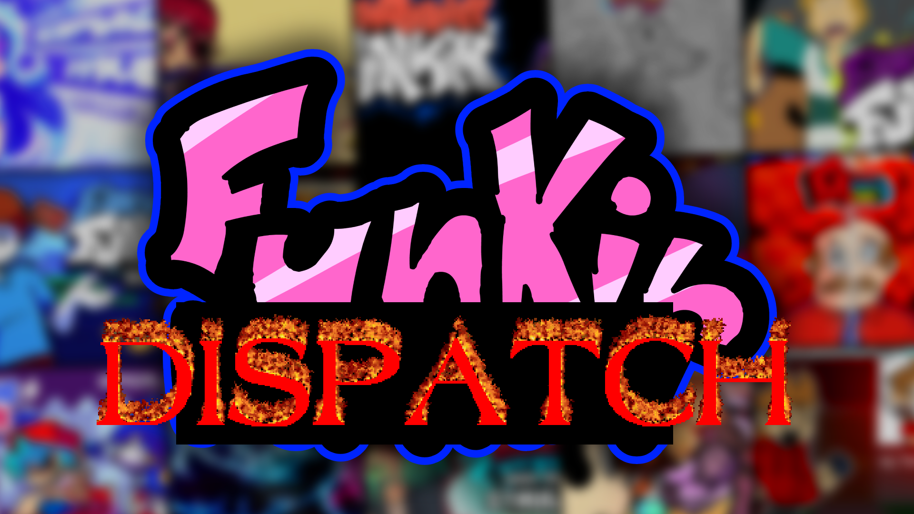
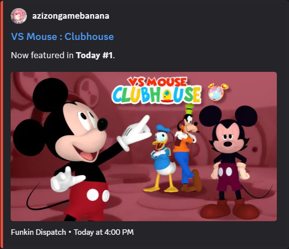

# Funkin Dispatch

Announces newly featured Friday Night Funkin' mods in a Discord channel. It checks GameBanana every 2 hours, posts each new or moved mod separately, and remembers current positions so unchanged mods are not reposted.

Dispatch is the announcement companion to [Funkin Hotline](https://github.com/immalloy/Funkin-Hotline). Hotline maintains one editable ranking message per period; Dispatch sends separate posts when a mod is new or changes position.

### docs

- **[setup](docs/setup.md)** - self-hosting, testing, and resetting state
- **[config](docs/config.md)** - periods, announcement types, filters, and intervals

### live view

See it live in [#funkin-dispatch](https://discord.com/channels/1447703759638626327/1524898478076199033) on the [Funkin Hotline Discord](https://discord.gg/yQvZ69fsm3).
