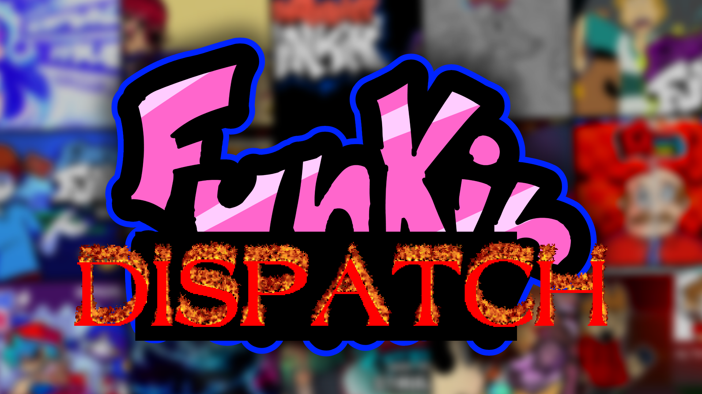
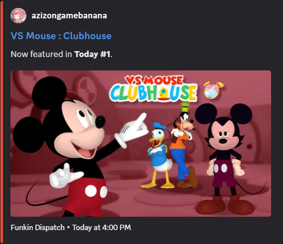

# Funkin Dispatch



Funkin Dispatch watches the featured Friday Night Funkin' mods on [GameBanana](https://gamebanana.com/) and posts updates to Discord.

It checks the feed on a schedule, remembers each mod's current position, and only posts when something changes. That includes new mods, ranking changes, moves between periods, and mods leaving the feed.

Dispatch is the announcement companion to [Funkin Hotline](https://github.com/immalloy/Funkin-Hotline). Hotline keeps one editable ranking message per period; Dispatch sends the individual updates.



## Run it

You need Go and a Discord webhook. Set the webhook URL, then run:

```powershell
$env:DISCORD_WEBHOOK_URL = 'https://discord.com/api/webhooks/...'
go run .
```

Use `--loop` to keep checking, or `--dry-run` to see what would be posted without sending anything or changing state.

The GitHub Actions workflow runs the same command every hour and saves the position snapshot back to `state.json`. More setup and self-hosting options are in [docs/setup.md](docs/setup.md).

## Embed colors

Each kind of update has its own color:

| Event | Color |
| --- | --- |
| New mod | Green |
| Ranking change | Blue |
| Period change | Purple |
| No longer featured | Red |

## Configuration

Edit [config.json](config.json) to choose the periods, filters, interval, and announcement types. The available settings are listed in [docs/config.md](docs/config.md).

## Live view

See it live in [#funkin-dispatch](https://discord.com/channels/1447703759638626327/1524898478076199033) on the [Funkin Hotline Discord](https://discord.gg/yQvZ69fsm3).
